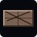

# Snake - FOK Edition

Snake FOK Edition uses classic Snake as its starting point, but it is as much a love letter to retro arcade gaming as it is a Snake clone. Power pellets, bonus multiplier chains, border barricades that crumble on impact, extra lives hidden across levels -- it all adds up to something that feels like flipping through an arcade cabinet catalogue from the 1980s.

**Play online:** https://poeggi.github.io/FOK/

## Items

| | Item | Description |
|:-:|------|-------------|
|  | **Gem** | The main collectible. 10 per level. Grab in the fewest steps for a x2 score bonus. |
|  | **Lucky Gem** | Rare gold gem. Worth 10x or 20x the normal score bonus. |
|  | **Epic Gem** | Extremely rare rainbow gem. Worth 100x or 200x the normal score bonus. |
|  | **Gouranga Bonus** | Seven orange gems appear in a line -- horizontal, vertical, or diagonal. Collect all seven in sequence for escalating x2, x4, x6 ... score multipliers. Hare Krishna. |
|  | **Power Pellet** | A Pac-Man nod. All barricades turn fragile for 5.5 seconds -- crash through everything. Barricades blink as the effect fades. |
|  | **1UP Heart** | Extra life. Appears once during levels 4-6 and occasionally on respawn in later levels. Blinks before disappearing. Can push you above the starting three lives. |
|  | **Barricade** | Solid orange brick. Colliding costs a life. Grows in number each level. |
|  | **Fragile Barricade** | Crumbling border block. The snake can smash straight through it for +1000 FOKoins and a debris effect. Activated by the Power Pellet. |

## Controls

| Input | Action |
|-------|--------|
| Arrow keys | Move snake / navigate menus |
| Space | Pause / unpause |
| Escape | Quit to menu (in-game) |
| Enter / OK | Select / confirm |
| Backspace | Delete (name entry) |
| M | Toggle music |

Mobile: X-shaped d-pad + OK/pause/ESC side buttons. Swipe the canvas to steer. Tap the canvas during name entry to open the keyboard.

## Difficulty modes

| | Easy | Normal | Hard |
|-|------|--------|------|
| Speed | Slow | Standard | Fast |
| Barricades | Few | Standard | Many |
| Growth per gem | +1 | +2 | +2 |
| Snake length at level start | Resets | Resets | Carries over from previous level |
| Achievements | Basic only | Full | Full + Iron Snake |

**Easy** awards only: first gem, level 1, level 5, and FOKoin milestones. Completing all 10 levels requires Normal or higher.

**Hard** carries your snake's full length into each new level, so the board fills up over time just like the original Nokia Snake.

## Features

- 10 levels - speed and barricades increase each level
- Snake grows by 1 segment per gem on Easy, 2 on Normal and Hard
- Screen wraps on all edges
- 3 lives - barricades and self-collision cost one life each
- 10 gems per level; collect in fewest steps for a x2 score bonus
- Lucky gems (x10/x20) and Epic gems (x100/x200) spawn randomly
- Pause with Space; quit-to-menu confirm on Escape
- Two music styles: NEW (3-channel chiptune) and CLASSIC (2-channel retro) - switchable in Settings
- Music pauses on death, resumes on restart
- Arcade SFX for eating, dying, level up
- High score table (saved locally, top 10)
- FOKoins: lifetime score accumulator across all sessions, spent in the shop
- Shop: cosmetic accessories for the snake head (cylinder hat, monocle, sunglasses, royal crown, bow tie)
- Achievements and expert achievements
- FPS counter
- Scrolling credits screen
- Mobile-friendly responsive layout with portrait and landscape support
- Installable PWA (works offline)

## Setup (GitHub Pages)

In repo Settings -> Pages -> Source: Deploy from branch -> main -> / (root)
